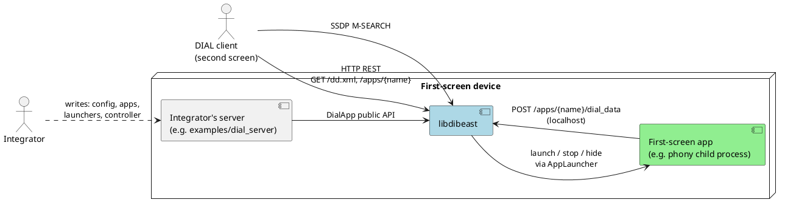

# Context and Scope

| Partner | Interface | Direction |
|---|---|---|
| Integrator | C++ public API of `libdibeast` ([Library API and ABI](08_4_library_api_and_abi.md)) | in |
| DIAL client | SSDP over UDP multicast (M-SEARCH request, unicast response) | in / out |
| DIAL client | HTTP/1.0 + 1.1 REST: device description and application resources | in / out |
| First-screen app | Whatever its `AppLauncher` does | out |
| First-screen app | HTTP `POST` of `x-www-form-urlencoded` additional data, localhost only | in |
