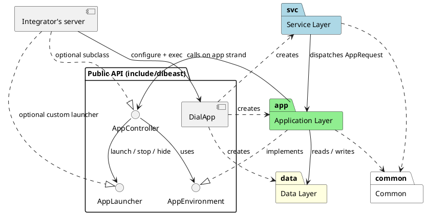
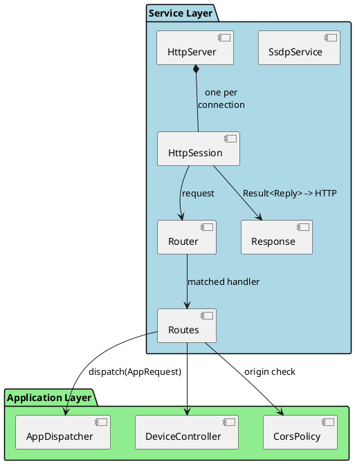
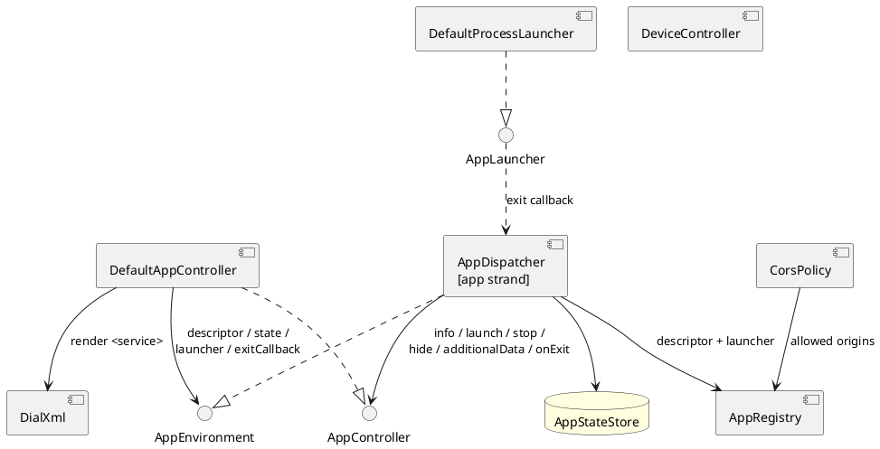

# Building Block View

## Level 1 - Library and layers

| Block | Responsibility |
|---|---|
| Public API | Facade and extension interfaces, no Boost; see [Library API and ABI](08_4_library_api_and_abi.md) |
| DialApp | Composition root: `io_context`, worker threads, signals; creates and wires all layers |
| Service Layer | Network protocols (SSDP, HTTP); decodes HTTP into `AppRequest`, encodes `Result<Reply>`; enforces [Security](08_3_security.md) rules |
| Application Layer | DIAL behaviour: runs the `AppController` on the app strand, device description, built-in launcher |
| Data Layer | In-memory app state |
| Common | Internal helpers: asserts, strand checks, `error_code` -> `Result`, URL building, constants |

## Level 2 - Service Layer

| Block | Responsibility |
|---|---|
| SsdpService | Answers M-SEARCH for the DIAL service type with a unicast reply after a random delay `<= MX` |
| HttpServer | Accepts TCP connections, one `HttpSession` each |
| HttpSession | Reads requests, writes responses; keep-alive, 4 KB body limit (413), idle timeout |
| Router | Matches method + path pattern to a handler; 400 malformed target, 404 unknown path, 405 wrong method |
| Routes | Binds endpoints to controller operations, builds `AppRequest`, applies CORS and `dial_data` rules |
| Response | `Result<Reply>` -> HTTP response; `ErrorCode` -> status ([Error Handling](08_2_error_handling.md)) |

REST endpoints:

| Method | Path | Operation | Spec |
|---|---|---|---|
| GET | `/dd.xml` | DeviceController | §5.4 |
| GET | `/apps/{name}` | `AppController::info` | §6.1 |
| POST | `/apps/{name}` | `AppController::launch` | §6.2 |
| DELETE | `/apps/{name}/{instance}` | `AppController::stop` | §6.4 |
| POST | `/apps/{name}/{instance}/hide` | `AppController::hide` | §6.5 |
| POST | `/apps/{name}/dial_data` | `AppController::additionalData` | §6.3 |

## Level 2 - Application Layer

| Block | Responsibility |
|---|---|
| AppDispatcher | Serializes controller calls on the app strand, answers 404 for unknown apps, implements `AppEnvironment`, relays launcher exits ([Concurrency](08_1_concurrency.md)) |
| DefaultAppController | DIAL §6 semantics for info / launch / stop / hide / `dial_data`; public, subclassable |
| DefaultProcessLauncher | Built-in `AppLauncher`: one executable as a Boost.Process child |
| AppRegistry | Name -> descriptor, launcher, parsed allowed origins; filled before `exec`, read-only afterwards |
| CorsPolicy | §6.6 origin check ([Security](08_3_security.md)) |
| DeviceController | UPnP device description plus `Application-URL` header |
| DialXml | Renders the DIAL `<service>` document |

## Level 2 - Data Layer

| Block | Responsibility |
|---|---|
| AppStateStore | `name -> AppState`; additional data kept even when stopped; app strand only |
