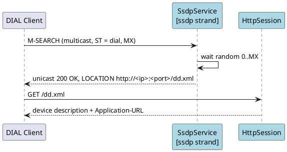
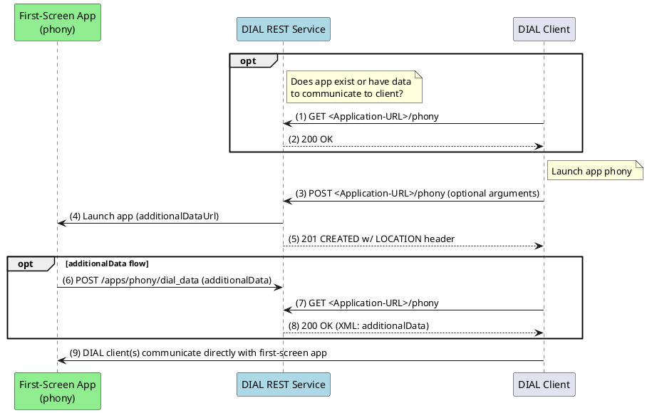
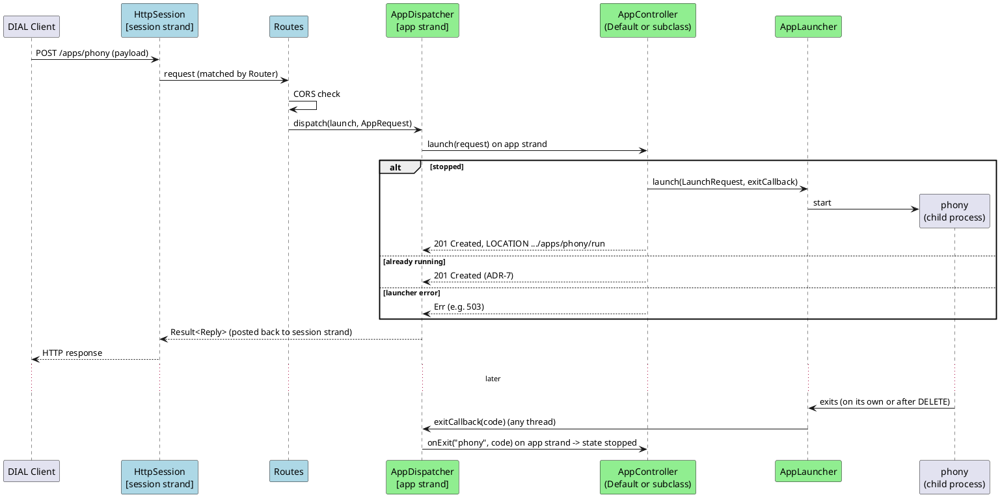

# Runtime View

## Scenario 1: Discovery

## Scenario 2: Application launch with additional data (from the spec)

Taken from the DIAL spec, Annex C ("DIAL REST Service: Application Launch"), with `phony` as app X.

## Scenario 3: The same launch through our building blocks

