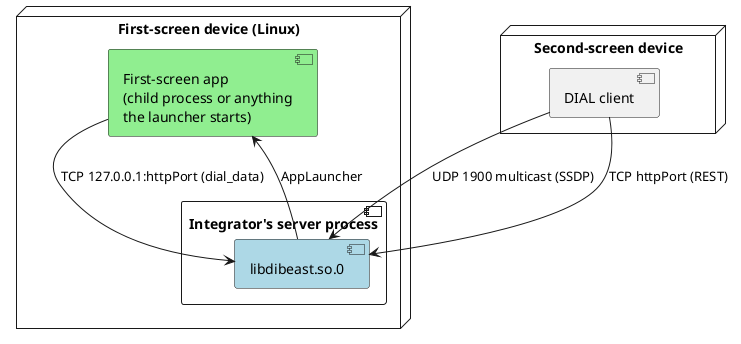

# Deployment View

| Element | Notes |
|---|---|
| `libdibeast.so.0` | Loaded by the integrator's process; one `DialApp` per process |
| Network | UDP 1900 on `239.255.255.250` (IPv4), TCP `Config::httpPort` (default 56789) on all interfaces |
| First-screen apps | Started by their launcher; the built-in one runs a child process that dies with the server |
