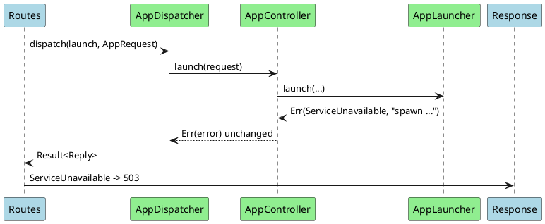

# Error Handling

## Rules

1. **No exceptions** ([ADR-2](09_architecture_decisions.md)). Our code never throws; integrator code
   (launchers, controllers, callbacks) must not throw either.
2. Every function that can fail returns **`Result<T>`**: a value or an `Error`, like Rust's `Result<T, E>`.
3. **One error type** for the whole library, so errors pass between layers unchanged.
4. Library calls use their non-throwing overloads (`error_code` variants, `std::from_chars`); an
   `error_code` becomes an `Error` right where it appears.
5. The only `try`/`catch` is a log-and-stop safety net around each `io_context::run()` for exceptions
   from outside our code (e.g. `std::bad_alloc`).

## Types (`Result.h`, public)

| Name | Meaning |
|---|---|
| `ErrorCode` | One enum for the whole library; only the service layer maps it to an HTTP status |
| `Error` | `code`, human-readable `message`, optional `headers` for the HTTP error response |
| `Result<T>` / `VoidResult` | `std::expected<T, Error>` / `Result<void>` |
| `Ok(...)` / `Err(...)` | Rust-style constructors; `Err` takes a code with a message or format arguments, or passes an existing `Error` on |

## Propagation across layers

